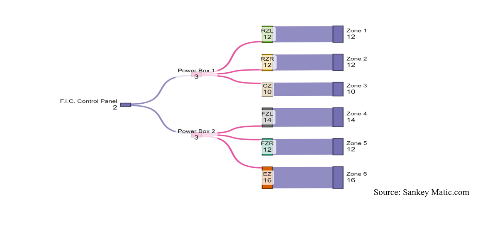
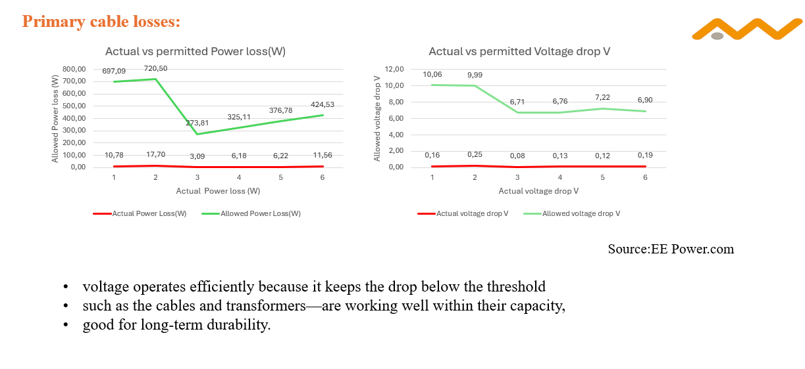
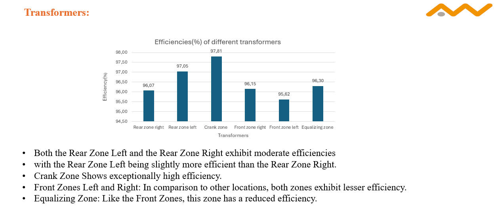
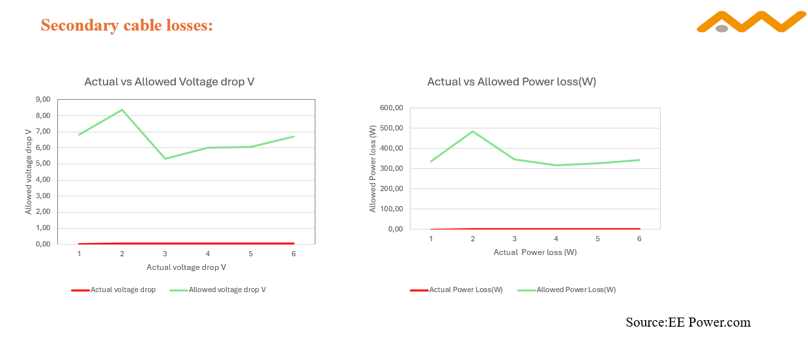
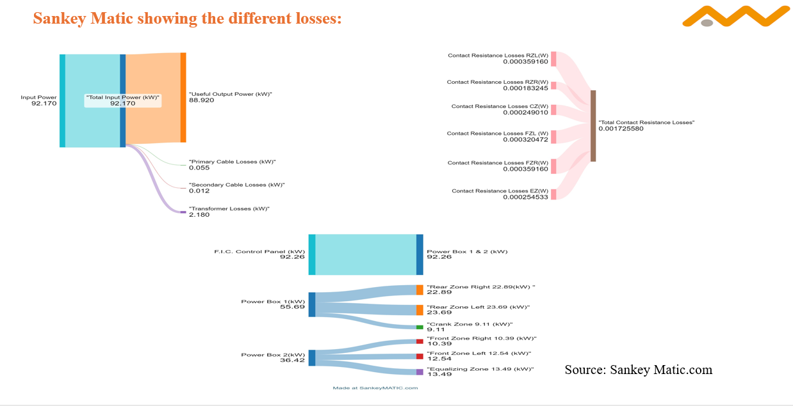

# ⚡ Industrial Energy Loss Optimization

## Power Loss Analysis & Optimization of Industrial Electrical Heating Systems

---

# 📌 Project Overview

This project focuses on the optimization of industrial electrical heating systems in the glass manufacturing industry.

The work was carried out during my Master's thesis collaboration with **F.I.C. Germany GmbH** as part of the M.Eng. International Energy Engineering program at OTH Amberg-Weiden, Germany.

The project investigates:

- transformer efficiency
- cable power losses
- electrical heating optimization
- energy efficiency improvement
- CO₂ reduction potential
- industrial energy cost optimization

---

# 🎯 Objectives

✔ Analyze electrical power losses in industrial heating systems  
✔ Evaluate transformer and cable configurations  
✔ Reduce unnecessary energy losses  
✔ Improve overall system efficiency  
✔ Support industrial decarbonization strategies  
✔ Optimize operational energy costs  

---

# 🏭 Industrial Context

Industrial electrical heating systems consume large amounts of electrical energy.

Small inefficiencies in:
- transformer design
- cable sizing
- magnetic induction systems
- electrical distribution

can lead to significant:
- energy losses
- operational costs
- CO₂ emissions

This project focuses on identifying and optimizing those inefficiencies.

---

# 🧠 Engineering Methodology

## 🔹 Data Collection
- industrial operational data
- transformer specifications
- electrical load analysis
- cable configuration analysis

## 🔹 Technical Analysis
- power loss calculations
- efficiency comparison
- load behavior analysis
- transformer optimization
- electrical system evaluation

## 🔹 Scenario Evaluation
Multiple optimization scenarios were evaluated based on:
- technical feasibility
- energy savings
- economic performance
- operational constraints

---

# 🛠 Tools & Technologies

| Category | Tools |
|---|---|
| Analysis | Excel, Polysun |
| Engineering | Electrical Heating Systems |
| Simulation | Energy Analysis |
| Evaluation | Economic & Technical Assessment |
| Methods | Optimization & Efficiency Analysis |

---

# 📊 Key Engineering Areas

## ⚡ Transformer Efficiency
Evaluation of transformer configurations to minimize electrical losses.

## 🔌 Cable Loss Reduction
Analysis of cable layouts and electrical distribution systems.

## 🌍 CO₂ Reduction
Identification of strategies to improve sustainability and reduce emissions.

## 💰 Cost Optimization
Optimization of operational energy costs using technical improvements.

---

# 📈 Key Outcomes

✔ Improved understanding of industrial electrical losses  
✔ Optimization-based engineering recommendations  
✔ Evaluation of multiple technical scenarios  
✔ Improved system-level energy efficiency  
✔ Support for industrial sustainability goals  

---

# 🏗 Engineering Focus Areas

- Industrial Energy Systems
- Electrical Heating
- Energy Efficiency
- Industrial Decarbonization
- Sustainability Engineering
- Energy Optimization
- Electrical Loss Analysis

---

# 📂 Repository Structure

```bash
industrial-energy-loss-optimization/
│
├── README.md
├── infrastructure-layout.png
├── primary-cable-losses.png
├── transformer-efficiency.png
├── secondary-cable-losses.png
├── sankey-loss-analysis.png
├── LICENSE
```

---

# 📸 Project Visuals

## 🏭 Industrial Infrastructure Layout



---

## 🔌 Primary Cable Loss Analysis



---

## ⚡ Transformer Efficiency Analysis



---

## 🔋 Secondary Cable Resistance Losses



---

## 🔁 Sankey Energy Loss Analysis



---

# 🚀 Future Improvements

- Advanced simulation integration
- Automated optimization workflows
- Data-driven energy analytics
- Industrial monitoring integration
- Python-based analysis automation

---

# 👨‍💻 Author

## Thirupathi Reddy Chipurla

🎓 M.Eng. International Energy Engineering  
🏛️ OTH Amberg-Weiden, Germany  

🔗 LinkedIn:  
https://www.linkedin.com/in/thirupathireddychipurla/

🌐 Portfolio:  
https://thirupathichipurla-eng.github.io/

---

# 📄 License

This project is shared for educational and portfolio purposes.
